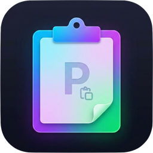

<p align="center">
  
</p>

# Pastelet

**Pastelet** is a secure, lightweight, and native clipboard manager for macOS, built with SwiftUI. It keeps your clipboard history accessible while prioritizing privacy and security through local encryption.

## Features

- **📋 Clipboard History**: Automatically tracks copied text and images.
- **🔒 Secure Encryption**: All clipboard data is encrypted using AES-GCM before being stored on disk. The encryption key is securely managed in your macOS Keychain.
- **📝 Code Snippets**: Save and organize frequently used text snippets for quick access.
- **🚫 App Exclusions**: Prevent sensitive applications (e.g., password managers) from being recorded.
- **⌨️ Global Hotkey**: Access your history from anywhere with `Cmd + Shift + V`.
- **⚡ Native Performance**: Built with SwiftUI for a seamless macOS experience.

## Installation

### Option 1: Download Release
1.  Download the latest DMG from the [Releases](https://github.com/yourusername/Pastelet/releases) page.
2.  Open the DMG and drag **Pastelet** to your Applications folder.
3.  **Important**: Since this is an open-source build without a paid Apple Developer ID, you may see a warning that the app is from an "Unidentified Developer".
    *   To open it: **Right-click** the app and select **Open**.
    *   Click **Open** again in the dialog.
    *   You only need to do this once.

### Option 2: Build from Source
1.  Clone the repository:
    ```bash
    git clone https://github.com/yourusername/Pastelet.git
    cd Pastelet
    ```
2.  Open `Pastelet.xcodeproj` in Xcode.
3.  Build and Run (Cmd + R).

## Usage

1.  **Access Menu**: Click the clipboard icon in the menu bar or press `Cmd + Shift + V`.
2.  **Paste Items**: Click on any history item to copy it to your current clipboard and paste it immediately.
3.  **Manage Settings**:
    *   **General**: Toggle "Launch at Login" or regenerate your encryption key.
    *   **Snippets**: Create, edit, or delete custom snippets.
    *   **Exclusions**: Add apps to the blocklist to stop Pastelet from recording them.

## Privacy & Security

Pastelet is designed with a "Local & Secure" philosophy:
*   **No Cloud Sync**: Your data never leaves your device.
*   **Encrypted Storage**: History is saved to disk only after encryption.
*   **Keychain Integration**: Encryption keys are stored in the macOS Keychain, ensuring only you can access your data.

## Technologies

*   **Swift 5.0+**
*   **SwiftUI**
*   **Combine**
*   **CryptoKit** (AES-GCM Encryption)

## License

[MIT License](LICENSE)
